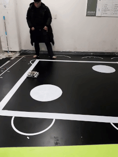
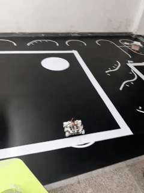
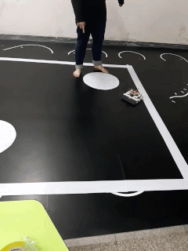
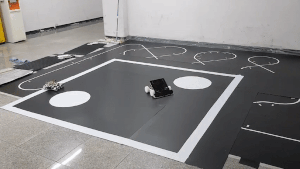
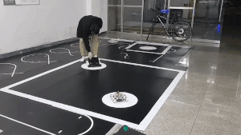
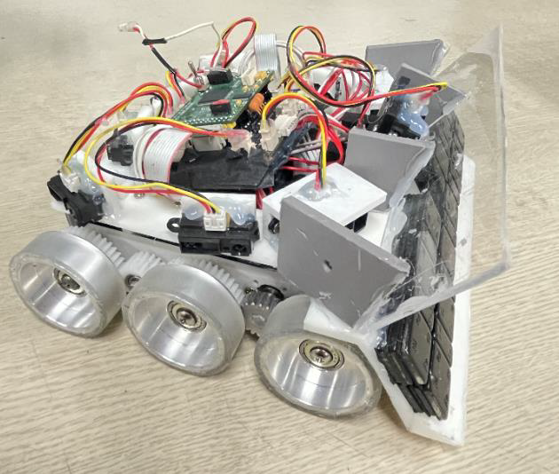

# 2020_IRC_SRC_SumoRobot

[단국대학교 MAZE](http://www.maze.co.kr) Hertz팀 개발내용

개발 기간 : 2020.08 ~ 2020.10  

주관 : [서울과학기술대학교](http://www.seoultechrobot.com/), 산업통상자원부
후원 : 한국로봇산업진흥원, (주)로보티즈

대회 결과 : [한국로봇산업진흥원장상(4위)](./PDF/2020씨름로봇대회_한국로봇산업진흥원장상.pdf)

## 팀원 구성

|팀원|맡은 역할|
|:---------:|:---:|
|[이진호 (팀장)](https://github.com/StylishPanther)| 전체 지휘 총괄 및 일정 조율, 공격 및 회피 구동 알고리즘 설계 |
|김원석|센서 퓨전 및 필터 설계| 
|이장훈|하드웨어 설계(Solidworks)|   
|김민우|대회판 및 하드웨어 제작|   

## 작품 목표    
 

1. FSM을 통한 Motion Planning 구현
2. 적외선 센서와 거리 센서에 Threshold를 적용하여 안정적인 ADC값 추출
3. 적 로봇의 위치와 인식 상황에 따른 회피, 공격 알고리즘 구현
4. 실격 규칙 (원형 맵에서 있어야 함, 흰색 원에서 5초 내 탈출) 지키기
5. 적 로봇이 실격 규칙을 어기도록 공격하기

 

## 동작 영상  

- [대회 영상 링크](https://www.youtube.com/watch?v=zMfaEX4JjlU)

 

  

 < 경기장 내부 주행 >
  

  

 < 적 로봇 인식 후 가속 공격 > &nbsp&nbsp&nbsp&nbsp&nbsp&nbsp&nbsp&nbsp&nbsp&nbsp&nbsp&nbsp&nbsp&nbsp&nbsp&nbsp&nbsp&nbsp&nbsp&nbsp&nbsp&nbsp&nbsp&nbsp< 후방 인식 후 역공 >

  

 < 적 로봇 인식 후 방향 전환 후 공격>

 

  

 < Sumo Robot ( Width : 200mm Column : 210mm Height : 130mm ) >
  

<!--
## 작품 설명  

### 하드웨어 품목  

|Hardware Type|Model Name|Datasheet|  
|:---:|:---:|:---:|
|CPU|Infineon TC27x|[PDF](./PDF/Infineon-tc27xD_usermanuel.pdf)|  
|Line Scan Camera|TSL1401-DB|[PDF](./PDF/tsl1401-db_manual.pdf)|  
|Infrared Distance Sensor|GP2Y0A02|[PDF](./PDF/GP2Y0A02YK.pdf)|  
|Motor Driver|IFX007T|[PDF](./PDF/Infineon-Motor_Control_Shield_with_IFX007T.pdf)|    
|Motor|RS540SH|[PDF](./PDF/RS_540SH_DATASHEET.pdf)|  
|Encoder|30S4-1024-6-L-5|[PDF](./PDF/E30S_series_37mnyih3.pdf)|
|Regulator|LM2576, TLE4271-2|[PDF](./PDF/TLE4271-2.pdf), [PDF](./PDF/LM2576_datasheet.pdf)|
|VFD|HCMS-2912|[PDF](./PDF/hcms_2912.pdf)|

### SDK

|SDK|Description|  
|:---:|:---:|  
|AruixTutorial| AurixRacer 튜토리얼|
|_iLLD_Framework_SB_TC27D|기본 프로젝트 Framework|  
 
## Software Architecture

### Debuging Environment

 자율주행 알고리즘 개발의 편의를 위하여 Infineon 사에서 제공하는 Framework를 기반으로 VFD를 이용해서 디버깅환경을 구축했다. 별도의 통신을 하지 않고, 초기 설정에서 Menu를 구현해 Sensor, Encoder, Line Tracking, Servo Motor, Velocity를 관리 할 수 있게 했다.

### Interrupt Scheduler
자율주행 알고리즘을 개발하면서 가장 핵심이 되는 부분은 Interrupt Scheduler 설계이다. 
Interrupt를 1ms Cycle로 하면서 구동부, 조향부, 센서부 제어를 안정적으로 하면서 다음 인터럽트에 영향을
미치는 Pending 현상을 방지하기 위해서 처리 시간까지 감안하여 자체적으로 설계를 하였다.

 

### Line Camera Signal Processing

Line Camera 로 받은 128개의 Pixel 값을 Median Filtering을 통해서 Ripple Noise를 제거 하였다.
검은색과 흰색의 명확한 값 차이를 주기 위해서 라인을 놓치지 않는 선에서 센서값을 주는 시간에 일
정 시간 Delay를 주어서 보다 명확하게 값을 인식하게 하였다. 환경에 따라서 값이 달라질 수 있는 가
능성을 고려하여 128개의 Pixel 중에 가운데 100개의 Pixel을 추출했다.

 

< Median Filter 적용 전, 후 >

### Velocity Control
 
속도제어를 위하여 PID 제어를 선택하였다. PID 제어는 현재 값과 추종 값 의 오차를 비례-적분-미
분 과정을 통하여 더 빠르고 유연한 제어가 가능해진다. 엔코더로 측정된 모터 회전수를 기어비와 바퀴
반지름을 통해서 얻은 상수로 계산을 통하여 제어 주기를 바탕으로 속도로 환산하여 사용했다. 보다 빠
른 추종을 위해서 가속도 개념을 추가하였다. 위의 그림은 1000mm/s의 속도를 2000mm/s^2의 가속도
로 추종하는 그래프이다. 정확히 0.5초 만에 추종하는 모습을 볼 수 있다.

 

< PID 제어를 통한 속도 추종 >

### AEB(Autonomous Emergency Braking)

AEB의 경우 속도와 가속도 제어를 이용해서 구현하였다. 거리 센서로 장벽을 인식하고 나서 1ms주
기로 돌아가는 모터 제어 함수를 통해서 속도를 가속도만큼 계속 감속시켜서 0mm/s까지 감속시키고
모터 출력을 차단한다.

 

< AEB를 통한 정지 속도 추종 >

### School Zone Detecting

횡단보도의 경우에는 라인만 검출 할 때 보다 Pixel의 개수가 많아지고, 그것을 기준으로 하여서 라
인을 검출할 때 보다 라인이라고 인식된 Sector의 개수가 많을 때 School Zone으로 인식하도록 하였
고, 똑같은 상황이 발생하였을 때 School Zone을 벗어나도록 구현하였다.

### Obstacle Avoidance

장애물을 인식하는 거리를 에커만 조향 방식을 이용해서 벗어날 수 있는 최소한의 거리를 계산하고,
그 거리보다 조금 더 여유로운 값을 주어서 안정적인 회피 주행이 가능하도록 하였다, 이에 더해, 조향
부의 더 정밀한 제어를 위해 각도단위보다는 서보모터의 최소 펄스를 최소단위로 해서 duty cycle을
결정했다.

 

< 장애물 회피 시뮬레이션 >

### Line Tracking

필터 처리된 100개의 Pixel값들은 20개의 Sector로 나누어서 라인을 검출하였고, 각 Sector마다 가
중치(무게값)를 주어서 라인을 따라 조향할 수 있게 하였다. 무게값은 실제로 라인카메라가 인식하는
Pixel간 거리를 측정하여서 에커만 조향이론을 바탕으로 결정하였다.

## Background

### 전원부 레귤레이터 방열 설계

 

 

TLE-4271-2는 최대 0.5A, 평균적으로 0.3A정도의 전류가 흘렀고, LM7803에는 평균적으로 0.5A가
흘렀는데 DataSheet를 참고해 각 상수를 얻어서 식(3)을 바탕으로 소자가 견딜 수 있는 한계 온도를
계산하여 방열판을 TLE-4271-2에는 소형 방열판 1개, LM7803에는 중형 1개, 소형 1개를 장착했다.

### 중간값 필터 (Median Filter)

미디언 필터(Median Filter)는 주어진 마스크 영역의 값들을 크기 순서대로 정렬한 후 중간 크기의
값을 선택하는 필터이다.

< Median Filtering >

### 애커만 조향 이론  (Ackerman-Jantoud tupe)

무게값을 통해 계산된 가중치(포지션)을 통해서 현재 위치에서 어느 정도 움직여야 하는지 최소 이동
거리와, 최소 조향각을 계산하여서 라인을 검출할 때 마다 계산하여 Line Tracking을 구현하였다.

< 에커만 조향 이론  >

## Reference
-->

